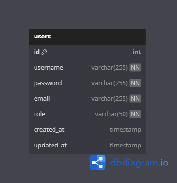
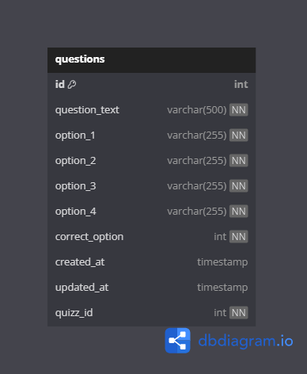
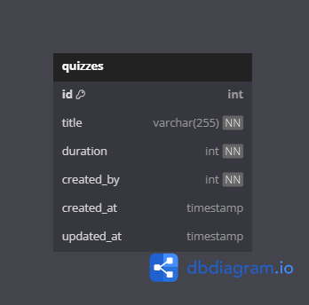
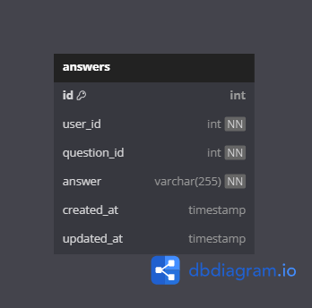
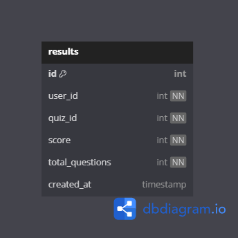
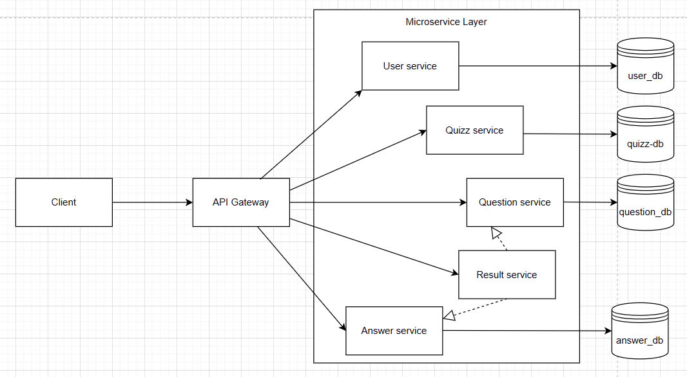

# 📊 Microservices System - Analysis and Design

This document outlines the **analysis** and **design** process for your microservices-based system assignment. Use it to explain your thinking and architecture decisions.

---

## 1. 🎯 Problem Statement

Hệ thống thi trắc nghiệm trực tuyến yêu cầu đảm bảo khả năng mở rộng, bảo mật và độ tin cậy cao. Người dùng có thể tạo đề thi, tham gia thi, nộp bài và xem kết quả thông qua giao diện web.
Hệ thống cần hỗ trợ:

- Đăng nhập, đăng ký và phân quyền người dùng.
- Quản lý ngân hàng câu hỏi.
- Quản lý đề thi trắc nghiệm (quiz).
- Ghi nhận câu trả lời của người dùng.
- Tính toán kết quả và lưu trữ.
- Tích hợp API Gateway để điều phối các request từ client.

## 2. 🧩 Identified Microservices

List the microservices in your system and their responsibilities.

| Service Name  | Responsibility                                | Tech Stack   |
|---------------|------------------------------------------------|--------------|
| service-user    | Quản lý người dùng (đăng ký, đăng nhập, phân quyền) | MySQL + SpringBoot|
| service-question   | Quản lý ngân hàng câu hỏi trắc nghiệm   | MySQL + SpringBoot |
| service-answer     | Xử lý câu trả lời từ người dùng               | MySQL + SpringBoot|
| service-quizz     | Tạo và cấu hình đề thi (quiz) từ danh sách câu hỏi          | MySQL + SpringBoot|
| service-result     | Nhận và xử lý kết quả thi, lưu trữ điểm và phân tích              | MySQL + SpringBoot|
| gateway    | API Gateway - Định tuyến và quản lý xác thực            | SpringBoot|

---

## 3. 🔄 Service Communication

| Từ             | Đến                    | Giao thức   |
|----------------|------------------------|-------------|
| Client         | API Gateway            | REST        |
| API Gateway    | User Service           | REST        |
| API Gateway    | Question Service       | REST        |
| API Gateway    | Quizz Service          | REST        |
| API Gateway    | Answer Service         | REST        |
| API Gateway    | Result Service         | REST        |

## 4. 🗂️ Data Design

| Service          | Data chính lưu trữ                                      |
|------------------|----------------------------------------------------------|
| service-user     | Tài khoản người dùng, mật khẩu mã hóa, vai trò (USER/ADMIN) |
| service-question | Danh sách câu hỏi, chủ đề, mức độ                         |
| service-quizz    | Cấu trúc đề thi, thời gian làm bài, danh sách câu hỏi     |
| service-answer   | Câu trả lời của người dùng, thời gian trả lời             |
| service-result   | Điểm số, thống kê, kết quả cuối cùng                      |
Mỗi service có một database độc lập

- user_db của service-user  
  

- question_db của service-question  
  

- quizz_db của service-quizz  
  

- answer_db của service-answer  
  

- result_db của service-result  
  

## 5. 🔐 Security Considerations

- Sử dụng **JWT Token** để xác thực người dùng qua Gateway.
- **API Gateway** kiểm tra `token`, giải mã và điều hướng tới service cần sử dụng.
- Service sẽ kiểm tra role để xác nhận quyền truy cập
- Kiểm tra quyền truy cập ở mỗi request:
  - USER: chỉ có thể xem/thi/nộp bài của chính mình
  - ADMIN: có thể tạo/sửa đề, thêm câu hỏi, xem thống kê

## 6. 📦 Deployment Plan

- Dự án sử dụng **Docker Compose** để triển khai toàn bộ hệ thống.
- Mỗi service có một **Dockerfile riêng** để build container độc lập.
- Biến môi trường được cấu hình trong `.env`, sử dụng trong `docker-compose.yml`.
- Các service sử dụng **network nội bộ** trong Docker để giao tiếp qua `service-name`.

## 7. 🎨 Architecture Diagram

## ✅ Summary

Summarize why this architecture is suitable for your use case, how it scales, and how it supports independent development and deployment.

## Author

This template was created by Hung Dang.
- Email: hungdn@ptit.edu.vn
- GitHub: hungdn1701

Good luck! 💪🚀
