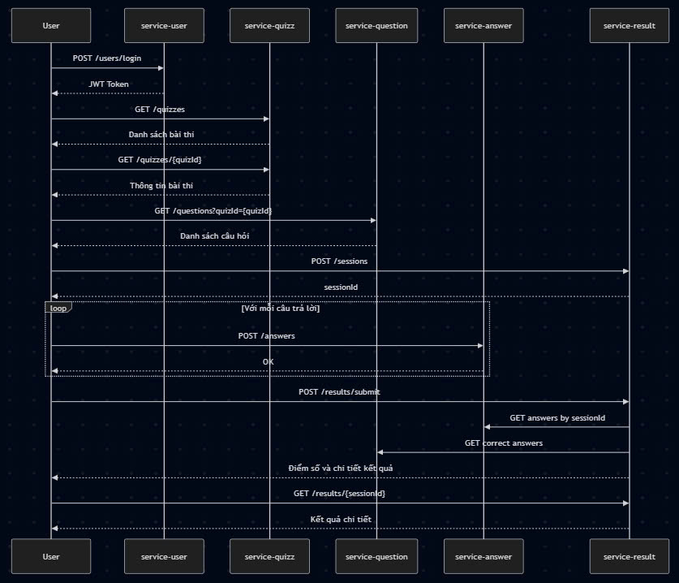

# System Architecture

## Overview
Hệ thống microservices được thiết kế để quản lý quy trình tạo bài thi, quản lý câu hỏi và câu trả lời của ngân hàng đề, kết quả thi của người dùng.

## System Components
| Service Name  | Responsibility                                 |
|---------------|------------------------------------------------|
| service-user  | Quản lý người dùng (đăng ký, đăng nhập, phân quyền) |
| service-question | Quản lý ngân hàng câu hỏi trắc nghiệm |
| service-answer | Xử lý câu trả lời từ người dùng |
| service-quizz | Tạo và cấu hình đề thi (quiz) từ danh sách câu hỏi |
| service-result | Nhận và xử lý kết quả thi, lưu trữ điểm và phân tích |
| gateway | API Gateway - Định tuyến và quản lý xác thực |

## Communication
- Giao tiếp từ client đến API Gateway sử dụng Rest API
- Giao tiếp giữa các container sử dụng Docker Compose với tên các service nội bộ như `service-user`, `service-question`, ...

## Data Flow
1. Admin gửi thông tin đề thi, câu hỏi và đáp án lên thông qua API Gateway
2. API Gateway gọi Question Service để lưu thông tin câu hỏi
3. API Gateway gọi Answer Service để lưu thông tin đáp án
4. Người dùng chọn câu trả lời, client tính toán số điểm dựa trên câu trả lời tương ứng với câu hỏi của đề thi
5. Client gửi thông tin kết quả bài thi về API Gateway
6. API Gateway gọi Quizz Service để lưu thông tin kết quả bài thi

## External Dependencies:
- **MySQL**: cho tất cả các service lưu trữ dữ liệu

## Diagram
- Reference a high-level architecture diagram (place in `docs/asset/`).

## Scalability & Fault Tolerance
- **Scalability**: Mỗi service có thể được scale độc lập.
- **Fault Tolerance**: Hệ thống có thể chịu lỗi khi một hoặc nhiều service không phản hồi, các service còn lại vẫn hoạt động bình thường nhờ vào cấu trúc microservices và sử dụng API Gateway để điều phối các yêu cầu.

---

## Security Considerations
- **Authentication & Authorization**: 
    - Sử dụng **JWT Token** cho việc xác thực người dùng qua Gateway.
    - **API Gateway** kiểm tra và giải mã `token`, sau đó điều hướng tới service cần thiết.
    - Kiểm tra quyền truy cập đối với mỗi request:
      - **USER**: chỉ có thể xem/thi/nộp bài của chính mình.
      - **ADMIN**: có thể tạo/sửa đề thi, thêm câu hỏi, và xem kết quả.
